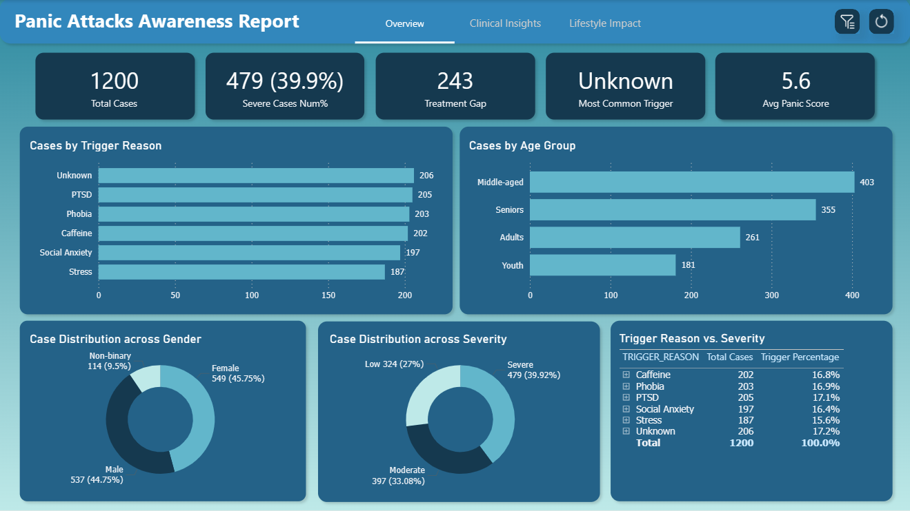
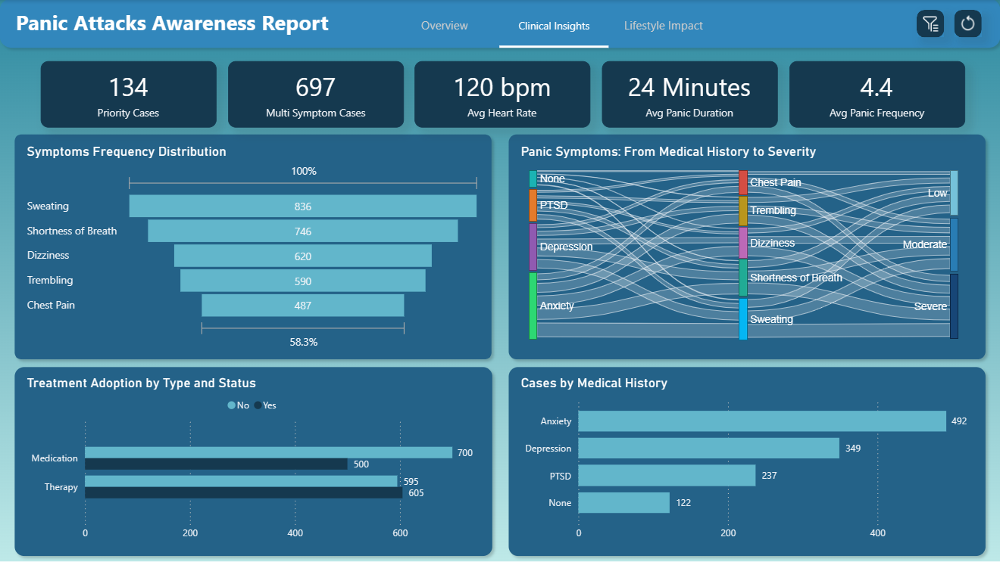
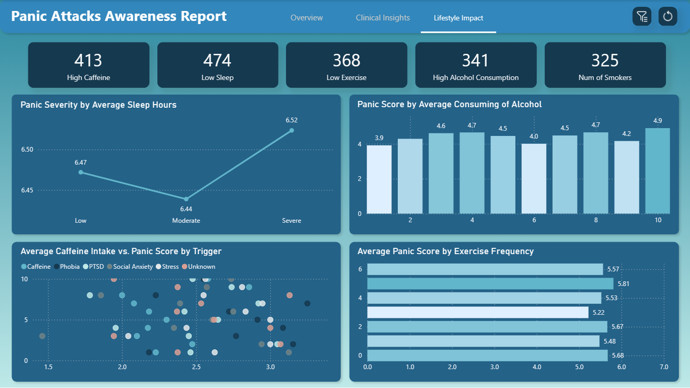

# Panic Attacks Awareness Analysis

This case study presents an analysis on **Panic Attack** cases using demographic, clinical, and lifestyle data to uncover insights that support awareness campaigns through an interactive Power BI dashboards.

---

## Business Task

**Develop an interactive Power BI report** that helps a non-governmental organization (NGO) raise awareness about panic attacks and their contributing factors.  
The goal is to identify patterns across demographics, clinical conditions, and lifestyle choices to guide public health initiatives and improve understanding of mental well-being.

---

## Tools Used

- **Snowflake:** As the primary data source for structured data extraction
- **Power Query:** For data ingestion, cleaning, and transformation
- **Power BI:** For building DAX measures & tables and developing interactive dashboards
- **Git & GitHub:** For version control and repository hosting

---

## Project Structure

| Folder        | Description                                      |
|---------------|--------------------------------------------------|
| `powerbi/`    | Power BI `.pbix` file and dashboard screenshots  |
| `data/`       | Data files used in the analysis                  |
| `README.md`   | Project documentation and findings               |
| `LICENSE`     | MIT License file                                 |

---

## Data Source

- **Dataset Type:** Synthetic dataset simulating real-world panic attack data 
- **Purpose:** For analytical and educational uses
- **Connection:** Dataset uploaded to **Snowflake** and connected to **Power BI**

---

## Data Cleaning & Transformation

- Adjusted column data types to match expected values
- Checked for nulls and errors
- Added custom and conditional columns to group data for analysis
- Replaced inconsistent values for clarity
- Built DAX measures to calculate KPIs and key statistics
- Developed DAX expressions to create tables

---

## Dashboards & Visualization

The Power BI report is presented through **three main dashboards**, each designed to deliver an interactive and insightful exploration of the panic attack dataset:

- **Overview Dashboard:** Provides a general overview with KPIs, demographic breakdown by gender and age, and population distribution by severity level and trigger
- **Clinical Insights Dashboard:** Analyzes medical and psychological aspects with KPIs, distribution and severity level of symptoms and medical history, and treatment status of cases
- **Lifestyle Impact Dashboard:** Focuses on lifestyle habits that may influence the occurrence and severity of panic attacks like sleep hours, caffeine and alcohol consumption, and exercise frequency
- **Filters Panel:** Added to each page for interactive data exploration, and personalized insights

**Dashboard Preview**  

Overview Dashboard:

Clinical Insights Dashboard:

Lifestyle Impact Dashboard:

Power BI file: [Panic Attack Analysis](powerbi) or [Download from Google Drive](https://drive.google.com/file/d/1FRow2m7r3SgTR59zlJtXMYJ6HnDsM3h1/view?usp=sharing)

---

## Key Insights for Campaign Strategy

- **Overview Dashboard:**
  - 479 people with severe panic scores (≥7/10) and that is nearly 1 in 3 people
  - 17% of cases have unknown triggers - highlighting the critical need for awareness
  - 243 individuals with severe panic scores are not receiving therapy
  - 403 of total cases are middle-aged people (36-50 years) and they represents 33%

- **Clinical Insights Dashboard:**
  - 134 individuals with severe panic scores are neither receiving therapy nor medication
  - 697 cases have multiple symptoms (≥3/5) 70% experience sweating, 62% shortness of breath
  - 595 people not reciving therapy and 700 not taking medication
  - 41% of cases have anxiety as medical history (492 cases)

- **Lifestyle Impact Dashboard:**
  - 325 smokers (27% of population)
  - 474 individuals have a low sleep frequency (< 6 hours)
  - People with severe panic score consume alcohol more than the average (>4.42 times/week)
  - 413 cases take high caffeine amounts (>3 cups/day)
  - 368 people have a low exercise frequency (<2 times/week)

---

## License

This project is licensed under the [MIT License](LICENSE)

---

## Author

**Aymen Mohammed** — Data Analyst passionate about using data to tell stories and drive business decisions.

 
 
 
